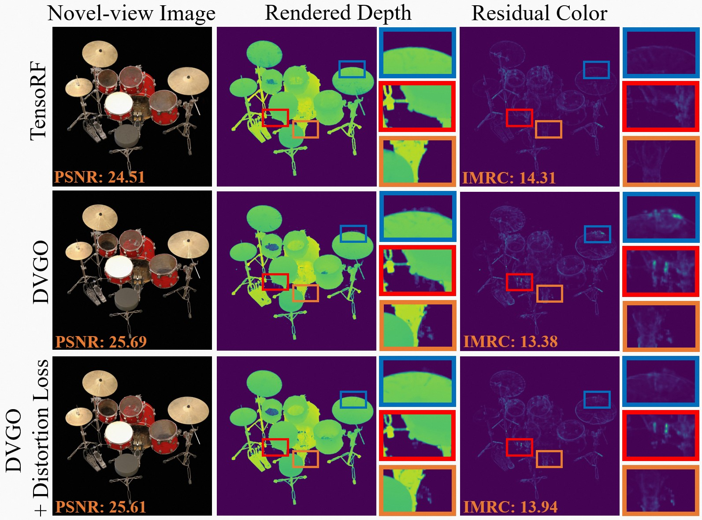
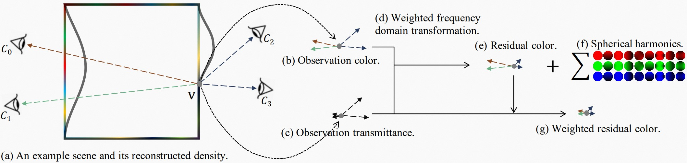

# Evaluate Geometry of Radiance Field with Low-frequency Color Prior

Qihang Fang*, Yafei Song*, Keqiang Li, Li Shen, Huaiyu Wu, Gang Xiong, and Liefeng Bo

\* Co-first author

Chinese Academy of Sciences, Institute of Automation

Alibaba DAMO Academy

arXiv: https://arxiv.org/abs/2304.04351


## About IMRC
Radiance field is an effective representation of 3D scenes, which has been widely adopted in novel-view synthesis and 3D reconstruction.
It is still an open and challenging problem to evaluate the geometry, i.e., the density field, as the ground-truth is almost impossible to be obtained.
One alternative indirect solution is to transform the density field into a point-cloud and compute its Chamfer Distance with the scanned ground-truth.
However, many widely-used datasets have no point-cloud ground-truth since the scanning process along with the equipment is expensive and complicated.
To this end, we propose a novel metric, named Inverse Mean Residual Color (IMRC), which can evaluate the geometry only with the observation images.
Our key insight is that the better the geometry is, the lower-frequency the computed color field is.
From this insight, given reconstructed density field and the observation images, we design a closed-form method to approximate the color field with low-frequency spherical harmonics and compute the inverse mean residual color. 
Then the higher the IMRC, the better the geometry.
Qualitative and quantitative experimental results verify the effectiveness of our proposed IMRC metric.
We also benchmark several state-of-the-art methods using IMRC to promote future related research.

<center>


</center>

One example of novel-view images, rendered depth according to the reconstructed density fields, and residual color of TensoRF, DVGO, and DVGO + Distortion Loss. From top two rows, though DVGO achieves a better PSNR (the higher the better), its geometry is qualitatively worse than TensoRF. From the bottom row, distortion loss could be qualitatively verified to improve the geometry. Our IMRC (the higher the better) could quantitatively evaluate these results correctly.

<center>


</center>

Illustration of the residual color computation process. 
(a) demonstrates an example scene (the colorful square) and its reconstructed density field (the black quadrangle). 
For a specific point v, we can obtain its observation colors (b) according to the captured images. 
To tackle the occlusion, the transmittance between the point v and each camera C could be taken as the confidence or weight of each observation, i.e., (c). 
Based on observation color (b) and confidence (c), the color could be weighted-transformed (d) into frequency domain (f) with the residual color (e). 
Due to the confidence (c), the residual color will be large if its corresponding confidence is low. 
To this end, the final residual color (g) also should be weighted by observation confidence (c).

## Installation
To evaluate the density field of a model, 
1) we first export a discrete density volume from the original model, including JaxNeRF, Plenoxels, DVGO, and TensoRF. 
2) Then evaluate the density volume and calculate the IMRC metric.

To export a density volume, we add a file named `export_density.py` to JaxNeRF, Plenoxels, DVGO, and TensoRF. Please follow their repositories to setup the environments for [JaxNeRF](https://github.com/google-research/google-research/tree/master/jaxnerf), [DVGO](https://github.com/sunset1995/DirectVoxGO), and [TensoRF](https://github.com/apchenstu/TensoRF).

Then, the code to calculate the IMRC metric is based on [Plenoxels](https://github.com/sxyu/svox2). Please setup the environment for IMRC as follows.

We recommend using Anaconda to set up the environment:
```sh
cd plenoxels
conda env create -f environment.yml
conda activate imrc
```

Then install the library `svox2`, which includes a CUDA extension.

If your CUDA toolkit is older than 11, then you will need to install CUB as follows:
`conda install -c bottler nvidiacub`.
Since CUDA 11, CUB is shipped with the toolkit.

To install the main library, simply run
```
pip install -e . --verbose
```
In the directory `plenoxels`.

## Data

We have backends for NeRF Synthetic, LLFF, and DTU dataset formats, and the dataset will be auto-detected.

Please get the NeRF Synthetic and LLFF datasets from:
<https://drive.google.com/drive/folders/128yBriW1IG_3NJ5Rp7APSTZsJqdJdfc1>
(`nerf_synthetic.zip` and `nerf_llff_data.zip`). 

Please get the DTU dataset from:
<https://drive.google.com/drive/folders/1Nlzejs4mfPuJYORLbDEUDWlc9IZIbU0C/data> (`data_DTU.zip`).

## Export a density volume
For JaxNeRF, DVGO, and TensoRF, we implement `export_dtu_density.sh`, `export_syn_density.sh`, and `export_llff_density.sh`. 
Just replace the directories with yours and activate the corresponding conda environment. 
For example, to export the density volumes of the DTU dataset produced by DVGO, first activate the conda environment of DVGO, then simply run

```sh
cd DirectVoxGO
bash export_dtu_density.sh
```
Note that for JaxNeRF, you do not need to enter the `jaxnerf` folder. Just stay in the parent `IMRC` folder.

For Plenoxels, it is not necessary to export a density volume if its resolution is the same as the trained Plenoxels' model resolution. 
We use the model checkpoints to calculate the IMRC directly. If you want to export different resolutions, set the `export_reso` below as you need.
For example, for the LLFF dataset, run 
```sh
cd plenoxels/opt
python export_density.py <ckpt_path> \
      --export_reso=598,665,400 \
      --export_radius=1.496031746031746,1.6613756613756614,1.0
```


## Calculate the IMRC metric
For each dataset, we implement scripts to calculate the IMRC metric in `plenoxels/opt`. For example, to calculate the IMRC metric for JaxNeRF on the DTU dataset, simply run
```sh
cd plenoxels/opt
bash metric_dtu_jaxnerf.sh
```

## Visualize the residual color
After calculating the IMRC metric, a volume of the residual color will be stored in the training directory of the model. 
We can visualize this volume by setting it as the density volume and render the accuracy maps as follows,

```sh
cd plenoxels/opt
python visualize_res_color.py \
     <data_dir> \
     <filepath_of_res_color_volume> \
     --config=configs/dtu.json \
     --color_scale=25
```

You can increase the `color_scale` in case the rendered residual color is hardly visible.

## Search for the best Chamfer Distance
For each density volume, we can extract its mesh by using the Marching Cubes algorithm. The algorithm searches for iso-surfaces from the volume, 
where a hyperparameter about the density level needs to be manually set. The hyperparameter usually significantly affects the resulting CD value.
Therefore, we vary this hyperparameter and search for the best CD. Specifically, we adopt the [golden-section search](https://en.wikipedia.org/wiki/Golden-section_search) algorithm, which effectively finds the local minimum, or probably the global minimum, of the CD in our case. The searching
process is ended when the distance between the last two searched CD values is no greater than 0.001. Since the calculation of CD needs the ground-truth point-cloud, 
this searching process is only applicable for the DTU dataset.

Our code is based on [a Python implementation of DTU MVS 2014 evaluation](https://github.com/jzhangbs/DTUeval-python). 
You can follow its instructions to download the STL point clouds and Sample Set in <https://roboimagedata.compute.dtu.dk/?page_id=36> and prepare the ground truth folder.

For example, to search for the best CD for the DVGO, simply run
```sh
cd plenoxels
bash calc_cd_dvgo.sh
```


## Citation
Cite as below if you find this repository helpful to your project:
```
@misc{fang2023evaluate,
      title={Evaluate Geometry of Radiance Field with Low-frequency Color Prior}, 
      author={{Qihang Fang and Yafei Song} and Keqiang Li and Li Shen and Huaiyu Wu and Gang Xiong and Liefeng Bo},
      year={2023},
      eprint={2304.04351},
      archivePrefix={arXiv},
      primaryClass={cs.CV}
}
```

## Acknowledgement
This repository is built on [Plenoxels](https://github.com/sxyu/svox2), 
[JaxNeRF](https://github.com/google-research/google-research/tree/master/jaxnerf), 
[DVGO](https://github.com/sunset1995/DirectVoxGO), [TensoRF](https://github.com/apchenstu/TensoRF), 
and [a Python implementation of DTU MVS 2014 evaluation](https://github.com/jzhangbs/DTUeval-python). 
Thanks a lot for these great projects.